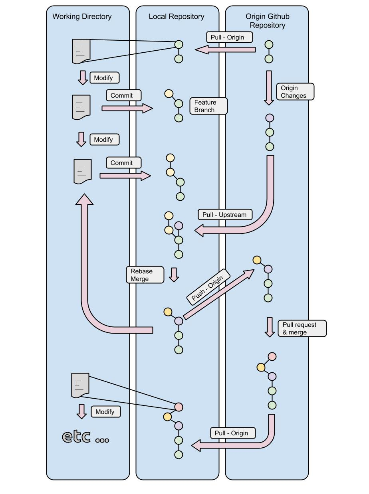
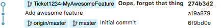
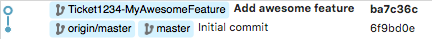
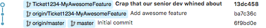
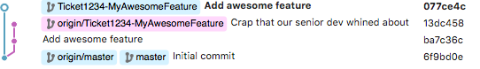
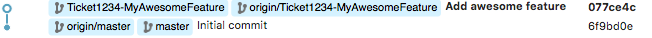
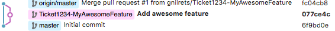
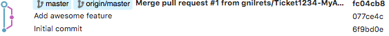

# Data Engineering Git workflow


A clean commit log is an important component of a good code repository.  It aids
team collaboration by enabling each team member to quickly understand changes
that were made.  It also facilitates troubleshooting by making it easier to
find when and where bugs were introduced.  There are innumerable number of
variations on git workflows in practice.  For Data Engineering at InsideTrack,
we use a version of a rebase/squash feature branch workflow (see
[here](https://www.atlassian.com/git/tutorials/comparing-workflows/feature-branch-workflow),
[here](https://randyfay.com/content/rebase-workflow-git),
and [here](http://reinh.com/blog/2009/03/02/a-git-workflow-for-agile-teams.html)
for similar workflows).

## Overview diagram



## Details

To **begin**, start with the master branch

````
git checkout master
````

Make sure it’s **up to date**

````
git fetch origin
git pull origin master
````

Create a **new feature branch**

````
git checkout -b Ticket1234-MyAwesomeFeature
````

Do work.  **Add changes** to git index
````
git add awesome_feature.rb
````

**Commit changes**

````
git commit -m "Add awesome feature"
````


Do more work.  Add changes to index

````
git add awesome_feature.rb
````

Commit more changes changes

````
git commit -m "Oops, forgot that thing"
````


**label: ready_for_review**

Now you're "all done" and ready for code review!  The reviewer isn't going to
care about the "Oops" and it doesn't need to be reviewed, so before submitting
the pull request, **squash and rebase** all changes on the **current master**.

````
git fetch origin
git rebase -i origin/master
````

The command `git rebase -i origin/master` initializes an **interactive rebase**.
This brings up a window in your default editor (set by environment variable
`EDITOR`.  e.g., `export EDITOR='emacs -nw'`).  The window that pops up will look
something like

````
pick a19a879 Add awesome feature
pick 274b3d2 Oops, forgot that thing

# Rebase 6f9bd0e..274b3d2 onto 6f9bd0e
#
# Commands:
#  p, pick = use commit
#  r, reword = use commit, but edit the commit message
#  e, edit = use commit, but stop for amending
#  s, squash = use commit, but meld into previous commit
#  f, fixup = like "squash", but discard this commit's log message
#  x, exec = run command (the rest of the line) using shell
#
# These lines can be re-ordered; they are executed from top to bottom.
#
# If you remove a line here THAT COMMIT WILL BE LOST.
#
# However, if you remove everything, the rebase will be aborted.
#
# Note that empty commits are commented out
````

Lines beginning with `#` can be ignored.  What you want to do now is **squash**
the changes, which is done by changing `pick` to `squash` for the "oops" commit:

````
pick a19a879 Add awesome feature
squash 274b3d2 Oops, forgot that thing
````

After you **save and exit**, the commit will be squashed, but now you'll need
to give the squashed commit a new commit message.  So, git will bring up
your editor again with something like

````
# This is a combination of 2 commits.
# The first commit's message is:

Add awesome feature

# This is the 2nd commit message:

Oops, forgot that thing
````

Again, the reviewer doesn't need to know anything about the "Oops", so it
should be removed from the commit message, resulting in just your original
commit message (when you thought you were "done"):

````
Add awesome feature
````

When writing the commit message for the reviewer, some effort should be made
to follow the guide for a [good git commit message](http://chris.beams.io/posts/git-commit/).
Pay particular attention to the first line length (rules #1 and #2) and
try to use the imperative style for the first line (rule #5: "When applied,
this commit will ...your commit message...").




Now, **push the feature branch** to github

````
git push origin Ticket1234-MyAwesomeFeature
````

Perform **code review** in github.  If the code review requires changes,
make those changes and **add** them to the git index

````
git add my_changes.rb
````


**Commit** those changes

````
git commit -m "Crap that our senior dev whined about"
````



**Push** those changes to feature branch for further code review

````
git push origin Ticket1234-MyAwesomeFeature
````

If the code review requires more changes, **goto ready_for_review**.  Otherwise,
yay, you're done!  Now **squash and rebase** all code review changes on
the **current master**.

````
git fetch origin
git rebase -i origin/master
````

Squash the code review intermediates:

````
pick ba7c36c Add awesome feature
squash 13dc458 Crap that our senior dev whined about
````

Remove the comment about the whiney dev.  Unless the code review revealed something
substantial, the reason and context for the modifications hasn't changed and you
can use the original commit message

````
Add awesome feature
````




Now, **force push** to the feature branch.  Since we're all done
with code review, there's no need to keep track of code review changes and
oopsies.

````
git push -f origin Ticket1234-MyAwesomeFeature
````



Now go into github and merge the branch onto the master branch.  It's safe
to delete the feature branch since it's no longer necessary.




**Lastly**, checkout the latest master and remove your local feature branch

````
git fetch
git checkout master
git pull origin master
git branch -d Ticket1234-MyAwesomeFeature
````


